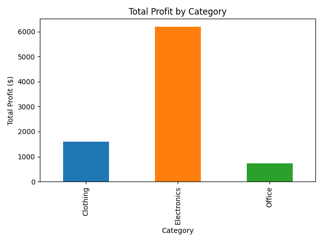

# 📊 Store Inventory & Profit Analytics

### 🚀 Executive Summary
**Goal:** Automate the analysis of sales data to identify high-profit product categories.
**Result:** Built an end-to-end Python pipeline that extracts data from a SQL database, transforms it using Pandas, and visualizes profit margins. The analysis revealed that **Electronics** drive **85% of total store profit**, despite lower sales volume compared to Clothing.

---

### 🛠️ Technical Skills Demonstrated
* **Python Integration:** Used `sqlite3` to programmatically manage database connections.
* **Advanced SQL:** Wrote complex queries using `JOIN` (3 tables) and `GROUP BY` to aggregate sales data.
* **Data Analysis:** Utilized **Pandas** for data frame manipulation and statistical summary.
* **Visualization:** Generated business-ready charts using **Matplotlib**.

---

### 📈 Key Business Insights
The automated analysis highlighted the following performance metrics:
1.  **Electronics:** Highest profit margin ($6,200), driving the bulk of revenue.
2.  **Clothing:** High volume but lower margin ($1,600).
3.  **Office Supplies:** Low performance ($720); candidate for inventory reduction.



---

### 💻 How to Run This Project
1.  **Clone the repository:**
    ```bash
    git clone [https://github.com/YOUR_USERNAME/store-inventory-analytics.git](https://github.com/YOUR_USERNAME/store-inventory-analytics.git)
    ```
2.  **Install dependencies:**
    ```bash
    pip install pandas matplotlib
    ```
3.  **Run the database setup (creates the raw data):**
    ```bash
    python create_inventory_db.py
    ```
4.  **Run the analysis:**
    ```bash
    python analyze.py
    ```
    *Output:* Displays statistical summary in console and saves `profit_by_category.png`.
